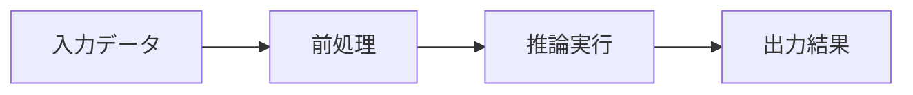
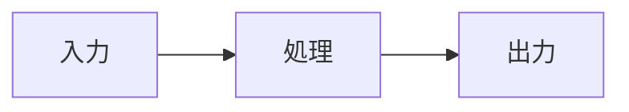

# slidev-theme-watabegg

`slidev-theme-watabegg`（バージョン 1.1.4）は、研究発表や進捗報告での利用を想定した Slidev 向けの個人用テーマです。Vue 3 と TypeScript で開発されており、MIT ライセンスで公開されています。

発表資料としての読みやすさを考慮し、日本語フォントには「M PLUS 2」、等幅フォントには「Fira Code」を採用しています。白を基調としたスライドに、5 色（red、yellow、green、blue、purple）のアクセントカラーを組み合わせて利用できます。カラーの初期値は green、デモ資料では blue を使用しています。コードハイライトには Shiki の `vitesse-light` および `vitesse-dark` を適用します。

## 動作環境と導入方法

本テーマの動作要件および開発環境は以下のとおりです。

- Node.js: >= 22.12.0
- Slidev: >= 53.0.0
- 開発時パッケージマネージャー: pnpm 11.1.3

### インストールと利用

公開されているテーマを自身のプレゼンテーションで使用する場合は、スライド先頭の YAML frontmatter でテーマを指定します。

```yaml
---
theme: slidev-theme-watabegg
---
```

リポジトリを複製してローカルでデモを確認したり、テーマ自体を開発したりする場合は、依存パッケージをインストールしたあとに開発サーバーを起動します。

```bash
git clone https://github.com/watabegg/slidev-theme-watabegg
cd slidev-theme-watabegg
pnpm install
pnpm dev
```

起動すると、`theme: ./` を指定したローカルのサンプルスライド `example.md` が表示されます。`example.md` ではコンポーネントや画像、キーボード操作といった機能デモに加え、アジェンダやセクション、表などのスライド例を確認できます。なお、リポジトリに含まれる過去の画像（`example/*.png`）は履歴上の記録であり、最新の表示結果ではないため本書には掲載していません。

## スライド全体の設定例

スライド全体に適用する既定値は、最初のスライドの frontmatter 内にある `themeConfig.watabegg` で設定します。

```yaml
---
theme: slidev-theme-watabegg
date: '2026-10-05'
themeConfig:
  watabegg:
    color: blue
    density: research
    footer:
      text: '研究室ミーティング'
    navigation:
      href: 'https://example.com/research'
      label: '発表一覧に戻る'
---
```

スライド全体で設定したアクセントカラー（`color`）は、各スライドの frontmatter で個別に指定して上書きできます（情報密度はスライド全体で固定されます）。

## 情報密度（Density）の調整

スライド全体の情報密度は、`themeConfig.watabegg.density` で `research`（既定値）または `comfortable` を指定します。認識できない値が指定された場合は `research` にフォールバックします。スライドごとの個別上書きには対応していません。

- `research`（標準・既定値）:
  - 本文: 20px / タイトル: 30px
  - 余白: 左右 28px、上 24px（下部はフッター表示時に 36px、非表示時に 24px を確保）
  - 段落、リスト、カードの間隔を詰めた引き締まった配置
- `comfortable`:
  - 本文: 24px / タイトル: 40px
  - 余白: 左右 32px、上 32px（下部はフッター表示時に 36px、非表示時に 24px を確保）
  - 全体的に間隔を広げたゆとりのある配置

```yaml
---
themeConfig:
  watabegg:
    density: comfortable
---
```

## フッター（Footer）の仕様と設定

スライドの可読性を損なわないよう、フッターには背景色、枠線、ホームリンクを設けず、11px のプレーンテキストで表示します。
左側に日付、中央に任意のテキスト（キャプション）、右側にページ番号（現在ページ / 総ページ数）が配置されます。ビューワーではスライド遷移アニメーションとは独立した固定フッターとして画面下部に常駐し、ページ番号が更新されます（一覧表示やプレビューでは個別の静的フッターとして描画されます）。

- 中央のテキスト: スライド全体の設定（`themeConfig.watabegg.footer.text`）で一度だけ指定します（スライドごとの `footer.text` は無視されます）。初期状態では空で、長すぎる場合は末尾が自動的に省略されます。
- 日付の表示優先度: 個別スライドの `footer.date` > スライド全体の `footer.date` > 個別スライドの `date` > スライド全体の `date` の順で適用されます。
- 自動非表示: `cover`、`image`、`image-scroll` の各レイアウトでは自動的にフッターが隠れます。フッターが非表示のときはコンテンツ下部の余白がわずかに縮小されます。フッター表示用の帯状オーバーレイ領域は配置していません。
- 表示制御と上書き:
  - スライド全体で非表示にする場合は、`themeConfig.watabegg.footer: false` を指定します。
  - 個別のスライドで非表示にする場合は、そのスライドの frontmatter で `footer: false` を指定します。
  - スライド全体でフッターを無効化している場合でも、個別スライドで `footer: true` を指定すれば通常のスライドとしてフッターを表示できます。
  - 個別スライドでは `date` や `pageNumber`（`pageNumber: false` でページ番号を非表示）を個別に上書きできます。

```yaml
---
themeConfig:
  watabegg:
    footer:
      text: '研究室ミーティング'
---
```

## アジェンダとセクションレイアウト

単一階層のアジェンダレイアウト（`layout: agenda`）とセクションレイアウト（`layout: section`）を使用します。スライド全体で単一のアウトラインを共有し、アジェンダと各セクションの番号が自動的に同期されます。

### デザイン仕様

- **文字サイズ**: アジェンダ項目の文字サイズは標準（research）で 30px、`themeConfig.watabegg.density: comfortable` 指定時は 36px です。
- **バッジ**: 丸型のテーマバッジ内に白文字で番号を表示します。フォントは本文と同じ M PLUS 2 の等幅数字（tabular nums）を用い、直径は標準で 44px、comfortable で 48px です。桁数が多い数字には枠内に収まるフォントサイズが自動適用されます。
- **余白**: アウトライン領域の余白はコンテンツ領域に対して上部 12px、左右 24px です。項目間の間隔は 24px、数字バッジとテキストの間隔は 18px です。
- **配色と表示要素**: 選択中の項目を含め、タイトルにはテーマ色を使用せず本文テキスト色を維持します。アジェンダやセクションにサブタイトルは表示されません。セクションスライドは白背景に同デザインの大きめの丸型バッジとテーマ色の下線が表示され、波形装飾はありません。本文の配置は任意です。

### アウトラインの生成方式

#### 自動生成（デフォルト）

スライド順に配置されたすべての `layout: section` スライドから、フラットな 1, 2, 3... のアウトラインを自動生成します。通常のコンテンツスライドは除外されます。タイトルは frontmatter の `title` または Markdown の `#` 見出しから取得され、スライド順を入れ替えるとアジェンダとバッジの番号も連動して更新されます。Markdown の `#` 見出しを使用した場合もタイトルは1度だけ表示されます。`level` プロパティは番号付けに影響しません。各セクションで個別に番号を指定する必要はありません。

```yaml
---
layout: agenda
title: Agenda
---

---
layout: section
title: 背景
---

---
layout: section
title: 手法
---
```

#### 手動定義

最初のアジェンダスライドで `agenda` 配列を指定すると、スライド全体で共有されるアウトラインを明示的に定義できます。文字列の配列または `{ title: '...' }` のオブジェクトを受け付け、以降のアジェンダスライドでは配列を省略して再利用できます。既存の `example.md` もこの定義に従っています。

```yaml
---
layout: agenda
title: Agenda
agenda: ['背景', '手法', '結果']
agendaActive: 2
---
```

手動定義では、セクションのタイトルが一意に一致すれば自動で紐付けられます。タイトルが異なる場合や重複している場合は、`sectionNumber: 2` のように既存の共有アウトライン項目番号を明示的に参照します（任意の新しい番号を割り振ることはできません）。不一致や曖昧なセクションにはバッジが表示されません。一方、自動生成セクションはスライド番号で識別されるため、同じタイトルの重複に対応します。アウトラインを明示的に無効化したい場合は、空配列 `agenda: []` を指定します。

### アクティブ項目の強調（agendaActive）

`agendaActive: 2` のように指定すると該当項目が太字（BOLD）でのみ強調され、文字色は本文色のまま保たれます（アクティブな親項目という概念はありません）。省略時は直前のセクションスライドと現在のページ情報（概要やエクスポート時など）から自動で強調されます。先頭のアジェンダスライドなど直前にセクションが存在しない場合は自動強調されないため、明示的に `agendaActive` を指定します。強調を無効化したい場合は `agendaActive: 0` を指定します。

## Mermaid

Slidev のスライド内で図表を作成する際は、Mermaid の標準的なコードフェンス記法を利用できます。テーマ側であらかじめフォントや配置の間隔を設定しているため、標準の記述のままでもスライド全体と調和した図表を表示できます。

### デフォルト設定とカスタマイズ

本テーマでは、`setup/mermaid.ts` によって以下の表示設定が初期値として適用されます。

- **フォント**: M PLUS 2（サンセリフ体）、文字サイズ 16px、クラシックな外観
- **フローチャート（flowchart）**: パディング 8px、ノード間隔（nodeSpacing） 24px、階層間隔（rankSpacing） 30px
- **シーケンス図（sequence）**: アクター枠を横長（幅 320px、高さ 32px）にし、余白や間隔を縮小して配置（アクターの反転配置 mirrorActors は無効）。これらはレンダラーに渡される初期値であり、実際の表示間隔はレンダラー側の仕様に依存する場合があります

配色はテーマ独自の色パレットではなく、Mermaid の標準色を維持しています。これらの設定を変更したい場合は、各コードフェンス内の先頭で Mermaid の YAML 設定ブロックを記述して上書きできます。詳細な記法については、[Slidev の Mermaid ドキュメント](https://sli.dev/features/mermaid.html) および [Mermaid のシーケンス図ドキュメント](https://mermaid.js.org/syntax/sequenceDiagram.html) を参照してください。

### ノードの整列と注意点

フローチャートで長方形ノードの高さを揃えるには、ノードの形状とラベルの行数を一致させる必要があります。異なる形状のノードを混在させたり、複数行のテキストを含むノードを配置したりすると、ノードごとに高さが変わります。SVG の表示サイズを自動調整してもノードや矢印の内部配置は再計算されないため、高さを揃えたい場合はダイアグラム側で記述を調整してください。

以下のようにラベルがすべて1行の長方形ノードを並べた構成では、ノードの高さが自然に揃います。



### DiagramFrame による自動サイズ調整

複雑な図を描画するとスライドの領域外にはみ出したり、逆に小さな図が意図せず拡大されてレイアウトが崩れたりすることがあります。`DiagramFrame` は、Mermaid の標準コードフェンスを囲むことで、アスペクト比を保ったまま縦横中央に自動配置するコンポーネントです。

#### 主な特徴とプロパティ

- **`height`**: フレームの最大高さをスライドの論理ピクセル単位で指定します（初期値: 260px）。後続の通常の本文段落や参考文献パネルに必要な領域がある場合は自動的にフレームが縮小されますが、最大高さを明示的に抑えたい場合にこの値を指定します。
- **`max-scale`**: 元の SVG サイズに対する拡大率の上限を指定します（初期値: 1）。初期値のままにしておくことで、小さな図が元の寸法以上に拡大されるのを防ぎます。

図を縮小すると内部のラベル文字も一緒に小さくなります。複雑な図を一定の枠内に収めながらフォントサイズだけを維持することはできないため、文字の可読性と図の密度のバランスを考慮してサイズを調整してください。

#### 使用上の注意

- `DiagramFrame` は1つのコンポーネントにつき1つの図を囲んでください。
- スライドの通常のフローレイアウト内で使用します。
- コードフェンス側の `scale` 設定と `DiagramFrame` の自動調整を併用すると予期しない表示になるため、サイズの制御は `DiagramFrame` の `height` または `max-scale` に一元化してください。
- Vue コンポーネントの開始タグ・終了タグとコードフェンスの間には、必ず空行を挟んでください。

#### 記述例

````markdown
上の段落の説明文を記述します。

<DiagramFrame :height="200" :max-scale="1">



</DiagramFrame>

下の段落で補足説明を続けます。
````


## 図・補足文・参考文献

スライド内で複数の実験結果を並べて比較したり、補足説明や出典情報を明記したりするためのコンポーネントを提供しています。

### FigureGrid

研究発表などにおいて、複数の画像やグラフを横一列に整列させて比較するためのコンポーネントです。

#### 仕様と動作

- **画像数**: `images` プロパティに `src` と `alt` を持つオブジェクトの配列を渡します。指定できる画像数は **2枚から4枚** に限られます。
- **配置と寸法**: 画像は横一列に並びます。各画像は正方形の枠内に収められ、CSS の `object-fit: contain` によって元のアスペクト比を維持したまま表示されます。元の画像が正方形でなくてもトリミング（切り抜き）は行われません。
- **自動サイズ計算**: コンポーネント全体の初期最大高さは 380 論理ピクセル（上下の補足文やキャプションを含む）です。画像の各辺の長さは、利用可能な高さと等分割された幅のうち、小さい方の値に合わせて自動的に決定されます。さらにサイズを抑えたい場合は、`height` プロパティで任意の高さを指定できます。
- **補足文とキャプション**: 画像の上下に2〜3行程度のテキストを配置できるよう、`#before` スロットと `#after` スロットを用意しています（段落 `<p>` と改行 `<br>` を使用）。全体の共通キャプションは `caption` プロパティで指定できるほか、インライン引用などを埋め込みたい場合は `#caption` スロットを利用できます。

標準的なスライドレイアウトでの使用を推奨します。前後の本文やキャプション、参考文献の分量が多いと画像の表示領域が狭くなります。要素を過密に配置すると視認性が損なわれる恐れがあるため、余白に余裕を持たせて構成してください。

#### 記述例

```html
<FigureGrid
  :images="[
    { src: '/plots/a.png', alt: '条件Aの測定結果' },
    { src: '/plots/b.png', alt: '条件Bの測定結果' }
  ]"
  caption="図1: 条件Aおよび条件Bの比較"
>
  <template #before>
    <p>比較対象の概要をここに記述します。<br>必要に応じて2〜3行程度で補足します。</p>
  </template>
  <template #after>
    <p>図から読み取れる結果の要点を記述します。<br>レイアウトに合わせて簡潔にまとめます。</p>
  </template>
</FigureGrid>
```


### SmallText

スライド本文の文字サイズ（research で 20px、comfortable で 24px）に対し、注釈や前提条件などの補足情報を一段控えめに掲載したい場合に `SmallText` を使用します。スライドの密度設定に連動して、research では 16px、comfortable では 18px で表示されます。

#### 仕様

- **ブロック表示**: 属性を指定しない場合、`<div>` 要素としてブロックレベルで描画されます。スロット内に空行を設けることで Markdown の段落を記述できます。安全に複数段落を組む場合は HTML の `<p>` タグも使用できます。
- **インライン表示**: `inline` 属性を指定すると、`<span>` 要素としてインラインで描画されます。

#### 記述例

```html
<!-- ブロック表示の例 -->
<SmallText>
  <p>※ 測定値は環境温度 20℃、湿度 50% の条件下で記録した暫定値です。</p>
</SmallText>

<!-- インライン表示の例 -->
<p>本文の途中で <SmallText inline>（詳細は補足資料を参照）</SmallText> のように注釈を挿入することもできます。</p>
```

### SlideReferences と Cite

各スライド内で引用した文献や参照元を明示し、スライド下部に統一された形式で表示するためのコンポーネントです。

#### 配置と挙動

- **表示位置**: 各スライドの下部、フッターの直上に1枚あたり1つの参考文献パネルとして配置されます。文字サイズ 11px、グレー（`#757575`）で表示され、長い URL は自動的に折り返されます。
- **余白の自動確保**: パネル自身の高さを測定し、スライドの通常フロー本文に対して追加の下部余白（padding）を確保します（スライドに絶対配置された TextBox などの要素は自動余白の管理対象外です）。
- **フッターとの分離**: スライド下部中央のフッターテキストはスライド共通の固定要素として維持され、参考文献パネルとは独立して表示されます。
- **一貫した書式**: 参考文献全体が規定のフォーマットで統一して表示されます。自由形式のスロットや独自のスタイル指定プロパティは提供していません。

#### Cite によるインライン引用とフォーカス移動

本文中では `Cite` コンポーネントを使って引用番号（例: `[1]`）を上付きの小さめの文字サイズで配置できます。

- **番号の指定**: `number` プロパティに正の整数を明示的に指定します。スライド全体を通した自動採番は行われないため、作成者が意図した一貫性のある文献番号を複数のスライドにわたって再利用できます。
- **フォーカス機能**: `Cite` をクリックするか Enter キーを押すと、同じスライド内にある対応する参考文献項目へフォーカスが移動します。ページ遷移やスクロールは行われません。なお、現在のスライド内に対応する番号の文献エントリが存在しない場合はフォーカスされません。

#### データ型仕様（厳格な識別共用体型）

`SlideReferences` の `:items` には、以下の仕様に基づいたオブジェクトの配列を指定します。不正なフィールドが含まれている場合や、パネル内で `number` が重複している場合は、正常な描画を装わずにコンポーネント作成エラーを目に見える形で画面に表示します。

各エントリの文字列は Vue によって安全にエスケープされるため、Markdown や HTML のメタデータとしては処理されません。出力時は左端に `[1]` のような番号が置かれ、続いて「著者名（カンマ区切り）、タイトル、出版社または掲載誌、年、アクセス日（存在する場合）、URL（存在する場合）」の順に整形されます。

| フィールド | 型 | 必須・任意 | 説明 |
| :--- | :--- | :--- | :--- |
| `number` | 正の整数 | 必須（全種別） | パネル内で一意となる文献番号。 |
| `type` | `'web'` \| `'book'` \| `'article'` | 必須（全種別） | 文献の種類。 |
| `title` | 空でない文字列 | 必須（全種別） | 文献のタイトル。 |
| `authors` | 空でない文字列の配列 | 種別による | 著者名一覧。`book` および `article` では必須。`web` では任意。 |
| `year` | 正の整数 | 種別による | 刊行年または発表年。`book` および `article` では必須。`web` では指定不可。 |
| `publisher` | 空でない文字列 | 種別による | 出版社。`book` で必須。`web` および `article` では指定不可。 |
| `venue` | 空でない文字列 | 種別による | 掲載誌または学会名。`article` で必須。`web` および `book` では指定不可。 |
| `url` | HTTP/HTTPS の絶対 URL | 種別による | 参照先 URL。`web` で必須。`book` および `article` では任意（指定時は絶対 URL が必須）。 |
| `accessed` | `YYYY-MM-DD` 形式の日付 | 種別による | 閲覧日（実在する日付）。`web` で必須。`book` および `article` では任意（指定時は実在する有効な日付が必須）。 |

#### 記述例

```html
<p>本文中で<Cite :number="1" />のように引用します。</p>

<SlideReferences :items="[
  {
    number: 1,
    type: 'web',
    title: 'Slidev Documentation',
    url: 'https://sli.dev/',
    accessed: '2026-10-05'
  }
]" />
```

書籍や学術論文を参照する場合は、上記の表で規定された必須項目を指定してください。

- **書籍（`book`）の指定例**: `authors: ['Christopher M. Bishop']`、`title: 'Pattern Recognition and Machine Learning'`、`publisher: 'Springer'`、`year: 2006`
- **学術論文（`article`）の指定例**: `authors: ['Ashish Vaswani', '...']`、`title: 'Attention Is All You Need'`、`venue: 'NeurIPS'`、`year: 2017`、`url: 'https://arxiv.org/abs/1706.03762'`

## その他のレイアウトとコンポーネント

### 収録レイアウト

- `cover`: 表紙用レイアウト。タイトル、サブタイトル、著者、日付、波模様（wave）を表示します。
- `two-cols`: 2 列レイアウト。タイトルに加え、`::left::` と `::right::` スロットで左右の内容を分割配置します。
- `image`: 指定した画像をスライド全体に表示します（`image` プロパティ）。
- `image-scroll`: 画像を表示し、マウスホイールやタッチ操作による縦スクロールに対応します（`image`、`imageScroll.offsetY` プロパティ）。
- `end`: 結びのスライド。タイトルを変更可能で（既定値は「ご清聴ありがとうございました」）、任意の本文スロットに対応します。戻りリンクは含まれません。
- Slidev 標準の組み込みレイアウト（`default`、`center`）も引き続き利用できます。

### 独自コンポーネント

- `QuestionList`: Markdown と数式（TeX）を混在させて再帰的にネストできるリストコンポーネントです。HTML はエスケープされますが、リンク（`http`、`https`、`mailto`、`tel`、および相対パス）は維持されます。
  - `items`: 文字列、または `{ text, label, items, formula, block }` のオブジェクト配列
  - `styles`: 各階層の記号スタイル配列（例: `['decimal-circle', 'katakana-paren', 'loweralpha-dot']`）
  - `start`: 各階層の開始番号配列（例: `[1, 1, 'c']`）
  - `styles` 文字列を構成するカウンターと装飾子（項目の `label` が指定されている場合は自動採番より優先）:
  - カウンター: `decimal` | `hiragana` | `katakana` | `kanji` | `upperalpha` | `loweralpha` | `none`
  - 装飾子: `circle` | `square` | `paren` | `dot` | `q` | `big-q` | `none`

```html
<QuestionList
  :items="[
    { text: '主要な課題', items: ['前提条件の整理', '評価基準の設定'] },
    '検証方法の選定'
  ]"
  :styles="['decimal-circle', 'katakana-paren']"
  :start="[1, 1]"
/>
```

- `TextBox`: スライド上の絶対座標に注釈ボックスを配置します。
  - 属性: `x`, `y`, `width`, `height`, `textBg`, `color`, `vClick`

```html
<TextBox :x="100" :y="220" :width="400" textBg="green">
  注釈
</TextBox>
```

- `KaTexReveal`: KaTeX による数式を描画します。必要に応じて `v-click` を指定することで段階的な表示が可能です。
  - 属性: `formula`（必須）、`block`（デフォルトは `false`）、`tag`（任意）。`class` や `v-click` の転送に対応します。

```html
<KaTexReveal formula="E = mc^2" :block="false" />
```

### ユーティリティと操作方法

- スタイルクラス: テキストを強調する `.text-highlight`、枠線付きコンテナを作成する `.card` を利用できます。また、Markdown の表には情報密度に応じた下部余白（標準で 20px、comfortable で 32px）が自動的に適用されます。
- キーボード操作:
  - `Enter`: 次のスライドまたは次のステップ（fragment）へ進む
  - `Backspace`: 前のスライドまたは前のステップへ戻る

## 埋め込みナビゲーション（Embed Navigation）

ポータルサイトや iframe 内にスライドを埋め込む際、スライド面上ではなく Slidev の操作パネル側に戻りリンクを設置できます。
従来のフッターや終了スライドにあった自動リンクは廃止され、`themeConfig.watabegg.navigation` で明示的に指定する方式に変更されました。

```yaml
---
themeConfig:
  watabegg:
    navigation:
      href: 'https://example.com/research'
      label: '発表一覧に戻る'
---
```

- リンクはスライド面上ではなく、ポインターを画面左下に近づけたときに表示される Slidev のビューワー操作パネル内に現れます。
- iframe 埋め込み時にも親ウィンドウ全体を遷移できるよう、アンカータグには `target="_top"` が設定されます。
- スライドのエクスポート時には出力に含まれません。
- 過去のリンク用フィールドからの自動引き継ぎは行われず、空のリンクや安全でない `href` は自動的に除外されます。

## 開発と保守（Development）

### 開発用コマンド

パッケージマネージャーには pnpm 11.1.3 を使用します。pnpm 11 組み込みの `lint` コマンドとの衝突を避けるため、リント実行時は明示的に `pnpm run lint` を実行してください。

- `pnpm dev`: 開発サーバーを起動
- `pnpm dev:polling`: Linux 環境でファイル監視数の上限（ENOSPC）が発生した場合にポーリング方式で起動
- `pnpm build`: 本番向けビルド
- `pnpm export`: スライドのエクスポート
- `pnpm screenshot`: スクリーンショットの生成
- `pnpm check`: 型チェック、リント、フォーマット検証、ビルド、パッケージ内容の検証（pack）を一括で実行
- `pnpm run lint`: リントチェックの実行
- `pnpm typecheck`: TypeScript の型チェック
- `pnpm format:check`: コードフォーマットの検証

CI 環境では、型チェック、リント、フォーマット、ビルド、パッケージ内容の検証（pack）、および依存関係の監査（audit）を実施します。また、バージョンタグ（`v*`）の付与時に npm へ公開するリリースワークフローが用意されています。

### 依存関係の調整理由

テーマの安定動作のため、主要な依存パッケージを更新しつつ、互換性の問題があるツールについては意図的にバージョンを固定しています。

- Slidev 53、Vue 3.5.43、Biome 2.5.15、KaTeX 0.19.0、marked 18.0.14、Playwright 1.63.0、vue-tsc 3.3.12、bumpp 12.3.0 を採用しています。
- TypeScript は 6.0.3 を維持しています。`vue-tsc` 3.3.12 が TypeScript 7 の内部構造を読み込めないためです。
- `markdown-it` は workspace overrides を用いて `^14.3.2` に固定しています（`package.json` の開発用依存関係でも peer 依存として提供）。これは、依存している `Comark` 0.3.4 が `markdown-it` バージョン 15 で削除された非公開ファイル（`lib/token.mjs`）を読み込んでいることへの回避策です。
- `floating-vue` は `5.2.2` に固定しています。Shiki 4.5.0 の Twoslash が `VMenu` 登録時にインポートする `rest[1].components.Popper.extends` が FloatingVue 5.4.0 では利用できず、5.2.2 のコンポーネント構成と互換性があるためです。
- `dompurify` はセキュリティ勧告を解消するため `^3.4.16` に更新しています。
- なお、上流の `braces` は最新の 3.0.3 でも未修正の高重大度な勧告（https://github.com/advisories/GHSA-vfj7-8cjw-p6xm ）が残っており修正版が存在しないため、依存関係の監査（`audit:prod`）が失敗する場合があります。
