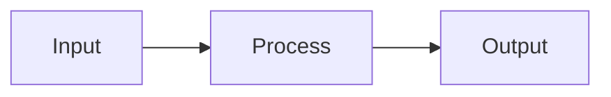

# slidev-theme-watabegg

A personal Slidev theme for research presentations and progress reports, with Japanese typography, compact content layouts, and optional larger text.

[日本語ドキュメント](./README.ja.md)

## Requirements and installation

Node.js **22.12+**, Slidev **53+**. This repository uses pnpm **11.1.3**.

```yaml
---
theme: slidev-theme-watabegg
---
```

For local development:

```sh
pnpm install
pnpm dev
```

The example deck uses `theme: ./` and demonstrates the theme’s layouts and components.

## Deck configuration

```yaml
---
theme: slidev-theme-watabegg
title: Research progress
date: '2026/10/05'
themeConfig:
  watabegg:
    color: blue
    density: research
    footer:
      text: Lab meeting · Progress report
---
```

Colors: `red | yellow | green | blue | purple` (default: green). Per-slide `color` overrides the deck setting.

## Density

| Setting | Body | Title | Horizontal / top padding |
|:--|:--|:--|:--|
| `research` (default) | 20px | 30px | 28px / 24px |
| `comfortable` | 24px | 40px | 32px / 32px |

The bottom margin is 36px with a footer and 24px without one. Paragraphs, lists, columns, and cards also adjust their spacing. Headings stay in normal flow. Set `themeConfig.watabegg.density` once for the deck. Per-slide density values are ignored.

## Footer

A small, transparent footer displays the date on the left, optional text in the center, and current / total pages on the right. It is hidden on `cover`, `image`, and `image-scroll` layouts.

```yaml
themeConfig:
  watabegg:
    footer:
      text: Conference presentation
```

Center text comes only from `themeConfig.watabegg.footer.text` and stays the same throughout the deck. The other slide footer fields merge with the deck settings. The date falls back to the slide's `date`, then the deck's `date`. Use `footer: false` to hide it on one slide or across the deck. A slide's `footer: true` can enable it when disabled deck-wide on a regular layout. Long footer text is truncated. The viewer footer stays outside slide transitions; overview and export pages retain their own page numbers.

## Agenda and section layouts

By default, the agenda is generated from `section` slides in slide order. Agenda numbers and section badges use the same single-level outline. Titles come from `title` in frontmatter or the slide's Markdown heading:

```yaml
---
layout: agenda
title: Agenda
---

---
layout: section
title: Background
---

---
layout: section
title: Methods
---
```

This produces **1 Background / 2 Methods**. Reordering section slides updates both the agenda and section numbers. Ordinary content slides are excluded.

To write an outline explicitly, set `agenda` on the **first** agenda slide. All agenda and section slides then share that outline:

```yaml
---
layout: agenda
title: Agenda
agenda:
  - Background
  - Methods
  - Results
agendaActive: 2
---
```

Items may be strings or objects with a `title`. Section slides match manual agenda items by their unique title. Use `sectionNumber: 2` on a section slide when titles differ or are repeated. An unmatched section has no number badge. Later agenda slides need only `layout: agenda`; they reuse the first outline.

`agendaActive` selects an item by its number. When omitted, an agenda after a section automatically emphasizes that section in bold. All item titles keep the body text color. `agendaActive: 0` disables emphasis.

Agenda text is 30px (36px in `comfortable`). All number badges are theme-colored circles with white numbers in M PLUS 2 using tabular numerals. Longer numbers shrink to fit the circle. The outline is inset from the heading, with consistent gaps between chapters. Section slides use a white background, the same numbered badge at a larger size, and a theme-colored underline. Neither layout displays a subtitle. Both accept optional body content.

The shared outline follows the [USTC theme's section-derived agenda](https://github.com/luocfprime/slidev-theme-ustc/blob/main/utils/sectionModel.ts); no additional theme dependency is required.

## Mermaid

Slidev [supports Mermaid natively](https://sli.dev/features/mermaid.html). The theme uses M PLUS 2, a classic appearance, compact flowchart spacing, and wide, short sequence actor boxes. Mermaid retains its default palette. Diagram-specific YAML configuration can override these defaults; see [Mermaid's sequence configuration](https://mermaid.js.org/syntax/sequenceDiagram.html).

Wrap a single diagram in `DiagramFrame` to fit and center its SVG automatically. It preserves the aspect ratio and leaves room for following paragraphs and references:

````md
Description above the diagram.

<DiagramFrame>



</DiagramFrame>

Description below the diagram.
````

`height` sets the frame's maximum logical slide height (default 260px). `max-scale` limits scale relative to the original SVG (default 1, so small diagrams are not enlarged). Use these props instead of combining automatic fitting with the fence's `scale` option. Shrinking also shrinks labels. To align flowchart node heights, use matching shapes and label line counts; the theme does not alter the graph's internal geometry.

The example includes a complex flowchart with matching rectangular nodes and a wide sequence diagram, both between paragraphs.

## Other layouts

| Layout | Usage |
|:--|:--|
| `cover` | Wave background with `title`, `subtitle`, `author`, `date` |
| `two-cols` | Optional `title` and `::left::` / `::right::` slots |
| `image` | Background from `image:` with optional annotations |
| `image-scroll` | Wheel / touch scrolling, initial `imageScroll.offsetY` |
| `end` | Custom `title` and optional body; no return link |

Slidev's built-in layouts such as `default` and `center` remain available. Colors can vary by slide. Density and the footer caption are deck-wide settings. Overview thumbnails and exports retain the appropriate footer for each slide. Markdown tables have a bottom margin of twice the paragraph spacing (20px by default).

## Components

### FigureGrid

Display **2–4 images** in a single row with one shared caption. Each image occupies a square box and preserves its aspect ratio without cropping. The default maximum height of 380 logical pixels includes the caption and before/after text; image sizes adapt to the remaining height and row width.

```vue
<FigureGrid
  :images="[{ src: '/plots/a.png', alt: 'Result A' }, { src: '/plots/b.png', alt: 'Result B' }]"
  caption="Figure 1. Comparison"
>
  <template #before><p>First line.<br>Second line.</p></template>
  <template #after><p>First note.<br>Second note.</p></template>
</FigureGrid>
```

The `before` and `after` slots allow 2–3 lines each. The `caption` slot replaces the caption prop and can contain `Cite`. Optional `height` further limits the total size. Use normal flow layouts; long text and references leave less space for images.

### SmallText

Supplementary text at 16px (`research`) or 18px (`comfortable`). It renders a block by default; `inline` renders a span.

```vue
<SmallText><p>Supplementary explanation.</p></SmallText>
<p>Body text <SmallText inline>(additional note)</SmallText></p>
```

### SlideReferences and Cite

One bibliography panel per slide, at 11px in muted gray above the footer. Its measured height adds bottom padding to normal flow content. Long URLs wrap. Absolute annotations need their own positioning.

```vue
<p>Source text<Cite :number="1" /></p>
<SlideReferences :items="[
  { number: 1, type: 'web', title: 'Slidev Documentation', url: 'https://sli.dev/', accessed: '2026-10-05' },
  { number: 2, type: 'book', title: 'Pattern Recognition and Machine Learning', authors: ['Christopher M. Bishop'], publisher: 'Springer', year: 2006 },
  { number: 3, type: 'article', title: 'Attention Is All You Need', authors: ['Ashish Vaswani et al.'], venue: 'NeurIPS', year: 2017, url: 'https://arxiv.org/abs/1706.03762' }
]" />
```

| Type | Required fields | Optional fields |
|:--|:--|:--|
| All | `number`: unique positive integer in the panel; `type`; `title` | — |
| `web` | `url`, `accessed` | `authors` |
| `book` | `authors`, `year`, `publisher` | `url`, `accessed` |
| `article` | `authors`, `year`, `venue` | `url`, `accessed` |

Authors are a nonempty array of names; year is a positive integer. URLs must be absolute HTTP(S) URLs. Access dates use valid `YYYY-MM-DD` dates. Invalid data or duplicate numbers produce a visible authoring error. Entries use a fixed order: authors, title, publisher/venue, year, access date, URL. Metadata is plain text.

`Cite` is optional and displays a small raised `[1]`. Clicking it or pressing Enter focuses the matching reference **on the same slide** without scrolling or changing slides. Assign numbers explicitly and reuse them consistently across the deck; numbering is not automatic. The bibliography is separate from the deck-wide footer caption.

### QuestionList

Nested questions with Markdown, per-level labels, and KaTeX formulas:

```vue
<QuestionList
  :items="['First **item**', { text: 'Second', items: ['A', 'B'] }]"
  :styles="['decimal-circle', 'katakana-paren', 'loweralpha-dot']"
  :start="[1, 1, 'c']"
/>
```

Counters: `decimal | hiragana | katakana | kanji | upperalpha | loweralpha | none`. Decorators: `circle | square | paren | dot | q | big-q | none`. An item's `label` overrides the generated label. Formula items support `formula` and `block`. Raw HTML is escaped; links accept HTTP(S), mailto, tel, and supported relative URLs.

### TextBox

Absolute annotations on image slides:

```vue
<TextBox :x="100" :y="220" :width="400" textBg="green">Annotation</TextBox>
```

Props: `x`, `y`, `width`, `height`, `textBg`, `color`, `vClick`.

### KaTexReveal

```vue
<KaTexReveal formula="E = mc^2" :block="false" v-click="1" />
```

Required `formula`, optional `block` (default false) and `tag`. Attributes such as `class` and `v-click` are forwarded.

## Embedded viewer navigation

The legacy `link` field no longer adds a footer or end-slide link. For embedded slides, explicitly add a return action to Slidev's viewer controls:

```yaml
themeConfig:
  watabegg:
    navigation:
      href: 'https://example.com/research'
      label: Back to presentations
```

Move the pointer near the bottom-left to show the controls. The link targets `_top` to leave the iframe. It is outside the slide and excluded from exports. Empty or unsafe URLs produce no link.

## Development

```sh
pnpm dev
pnpm dev:polling  # Linux watcher-limit fallback
pnpm typecheck
pnpm run lint
pnpm format:check
pnpm check       # tests, types, lint, formatting, build, package contents
pnpm build
pnpm export
pnpm screenshot
```

Use `pnpm run lint` explicitly because pnpm 11 also has a built-in lint command. CI additionally audits production dependencies. TypeScript stays on 6.x for vue-tsc compatibility. Markdown-it 14 is used for Slidev 53's Comark adapter, which imports a private module absent in Markdown-it 15. FloatingVue is kept at 5.2.2 for Shiki Twoslash compatibility, and transitive DOMPurify copies are upgraded to 3.4.16. For release 1.2.0, `@slidev/types` moved to `devDependencies` by exporting setup functions directly with type-only imports and `satisfies` checks, without altering settings or shortcuts. As a result, the production dependency graph no longer includes the unfixed [braces advisory](https://github.com/advisories/GHSA-vfj7-8cjw-p6xm), and production audits remain enabled without exceptions. Note that development dependencies still include `braces` through Slidev's build tooling.

Fonts: M PLUS 2 / Fira Code. Shiki: vitesse-light / vitesse-dark. Utilities: `.text-highlight`, `.card`. Shortcuts: **Enter** next slide / fragment, **Backspace** previous.
