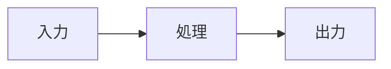
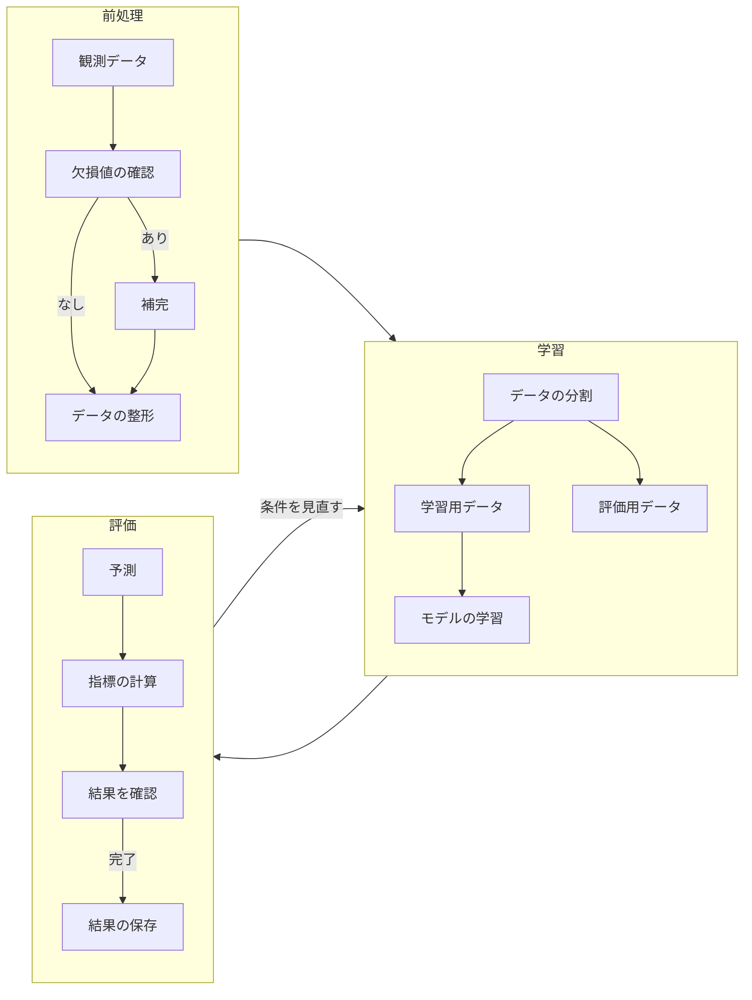
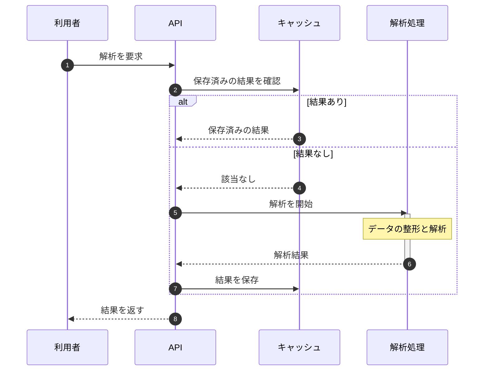

# 基本機能とスタイル

このスライドではテーマの基本スタイルをテストします。

- **太字** / *斜体* / `code`
- 入れ子リスト
  - 第二階層
  - もう一つ
- テーマカラーは `themeConfig.watabegg.color` で deck 全体に設定可能
- 各スライドの frontmatter `color` で個別上書きも可能

```ts
function hello(name: string) {
  console.log(`Hello, ${name}`)
}
```


---
layout: agenda
title: Agenda
agenda:
  - レイアウト
  - コンポーネント
  - その他の機能
agendaActive: 2
---

---
layout: two-cols
title: 2カラムレイアウト
color: green
---

::left::
### 左側
- ポイント1
- ポイント2
- ポイント3

左右に内容を分割表示。

::right::
### 右側
```js
const nums = [1,2,3]
const doubled = nums.map(n=>n*2)
console.log(doubled)
```
図表 / コード / 説明などを分割表示。

---
layout: section
title: コンポーネント
---

---

# QuestionList 基本

<QuestionList
  :items="[
    '正答のためのリストコンポーネント **Markdown OK**',
    {
      text: '2番目 (子を含む)',
      items: [
        { label: 'A', text: 'A の内容'},
        { label: 'B', text: 'B の内容'},
        { text: 'さらにネスト', items: ['深い1', '深い2'] }
      ]
    },
    { label: '★', text: 'labelスタイルも複数用意しカスタムも可能。' }
  ]"
  :styles="['decimal-circle','katakana-paren','loweralpha-dot']"
/>

---

# QuestionList start 指定

配列で各階層の開始番号/文字を指定可能。

<QuestionList
  :items="[
    { text: '大問1: サブ', items: ['1つ目','2つ目'] },
    { text: '大問2: サブ', items: ['A','B','C'] }
  ]"
  :styles="['decimal-q','hiragana-paren']"
  :start="[1,1]"
/>

---

# KaTeX と QuestionList

KaTeX コンポーネント `<KaTexReveal>` を QuestionList 内で使用可能。

<KaTexReveal formula="\int_0^{2\pi} \sin x\,dx = 0" block class="text-2xl" />

<KaTexReveal
  formula="E = mc^2"
  :block="false"
  class="text-primary font-bold"
  v-click="1"
/>

---

# KaTeX と Markdown の混在

<QuestionList
  :items="[
    {
      label: '①',
      text: 'Markdownと **KaTeX** を混在',
      items: [
        { formula: 'a^2 + b^2 = c^2', block: true, class: 'text-lg', tex: true },
        { text: '$$\\frac{d}{dx} \\sin x = \\cos x$$' }
      ]
    },
    {
      label: '②',
      formula: '\\sum_{k=1}^n k = \\frac{n(n+1)}{2}',
      block: false,
      class: 'text-xl'
    }
  ]"
  :styles="['decimal-circle','loweralpha-paren']"
  :start="[1]"
/>

---
layout: image
image: 'https://images.unsplash.com/photo-1501594907352-04cda38ebc29?auto=format&fit=crop&w=2370&q=80'
---

<TextBox :x="80" :y="140" :width="360" v-click="1">1番目に表示される注釈。</TextBox>
<TextBox :x="200" :y="380" :width="340" textBg="green" v-click="2">背景色付き 2番目。</TextBox>
<TextBox :x="500" :y="120" :width="300" color="red">常時表示 (赤文字)。</TextBox>
<TextBox :x="40" :y="20" :width="420" textBg="yellow" v-click="3">最後に表示される黄色背景。</TextBox>

---
layout: image-scroll
image: 'https://images.unsplash.com/photo-1501785888041-af3ef285b470?auto=format&fit=crop&w=2400&q=80'
imageScroll:
  offsetY: -120
---

## image-scroll: 縦長画像を「横幅フィット＋縦スクロール」で表示

- 画像はスライド幅に合わせて表示
- 縦方向はホイール / タッチでスクロール
- `offsetY` で初期位置を調整（中心からのpx）

ここでは `offsetY: -120` で少し上寄せしています。

---
layout: image-scroll
image: 'https://images.unsplash.com/photo-1500530855697-b586d89ba3ee?auto=format&fit=crop&w=2400&q=80'
---

## offsetY の例（中心から上へ 300px）

背景の見せたい位置が決まっているときに便利です。

---

# テーブル

| レイアウト | 用途 |
|:--|:--|
| agenda | 目次 |
| section | 章タイトル |
| two-cols | 2カラム |

表の下には余白が入ります。

---

# Mermaid



---

# Mermaid：処理の流れ

データの整形から学習・評価までの流れを示します。

<DiagramFrame>



</DiagramFrame>

評価結果を確認し、必要に応じて学習条件を見直します。

---

# Mermaid：処理のやり取り

キャッシュがある場合と、解析が必要な場合を分けて示します。

<DiagramFrame :height="320">



</DiagramFrame>

一度解析した結果は保存し、同じ要求では再利用します。

---

# 図を2枚並べる

<FigureGrid
  :images="[
    { src: '/examples/sin.svg', alt: 'sin x' },
    { src: '/examples/cos.svg', alt: 'cos x' }
  ]"
  caption="図1　sin x と cos x"
>
  <template #before>
    <p>同じ範囲で2つの関数を比較します。<br>横軸は x、縦軸は関数の値です。</p>
  </template>
  <template #after>
    <p>どちらも周期は 2π です。<br>位相が π/2 だけ異なります。</p>
  </template>
</FigureGrid>

---

# 図を4枚並べる

<FigureGrid
  :images="[
    { src: '/examples/sin.svg', alt: 'sin x' },
    { src: '/examples/cos.svg', alt: 'cos x' },
    { src: '/examples/gaussian.svg', alt: 'exp(-x²)' },
    { src: '/examples/sinc.svg', alt: 'sin x / x' }
  ]"
  caption="図2　4つの関数の比較"
>
  <template #before>
    <p>横軸の範囲を揃えて表示しています。<br>同じ大きさの図を横に並べる例です。</p>
  </template>
  <template #after>
    <p>各図をまとめて1つのキャプションにします。<br>補足の文章は図の下にも置けます。</p>
  </template>
</FigureGrid>

---

# 小さい文字と参考文献

Slidev の記法は公式ドキュメントで確認できます。<Cite :number="1" />

<SmallText>
  <p>補足の説明は SmallText で少し小さく表示します。</p>
</SmallText>

書籍<Cite :number="2" />や論文<Cite :number="3" />も、同じ形式で下部に表示します。

<SlideReferences :items="[
  { number: 1, type: 'web', title: 'Slidev Documentation', url: 'https://sli.dev/', accessed: '2026-10-05' },
  { number: 2, type: 'book', title: 'Pattern Recognition and Machine Learning', authors: ['Christopher M. Bishop'], publisher: 'Springer', year: 2006 },
  { number: 3, type: 'article', title: 'Attention Is All You Need', authors: ['Ashish Vaswani et al.'], venue: 'NeurIPS', year: 2017, url: 'https://arxiv.org/abs/1706.03762' }
]" />

---

# ユーティリティ

普通のテキストと <span class="text-highlight">ハイライト</span>。

<div class="card mt-8" v-click="1">
  <h3>カードスタイル</h3>
  <p>重要事項をまとめるのに便利です。</p>
</div>

---

# フッターとショートカット

このテーマでは Enter / Backspace キーで進行を制御できます。

- Enter: 次のスライド / v-click
- Backspace: 前へ戻る
- フッター: (cover / image / image-scroll 以外) 日付 + 任意のテキスト + ページ番号

---

# まとめ

- レイアウト: cover / agenda / section / two-cols / image / image-scroll / end
- コンポーネント: QuestionList / TextBox / KaTexReveal
- 自動フッター
- ラベルスタイル多彩 & Markdown 埋め込み

ご利用ありがとうございます

---
layout: end
---
